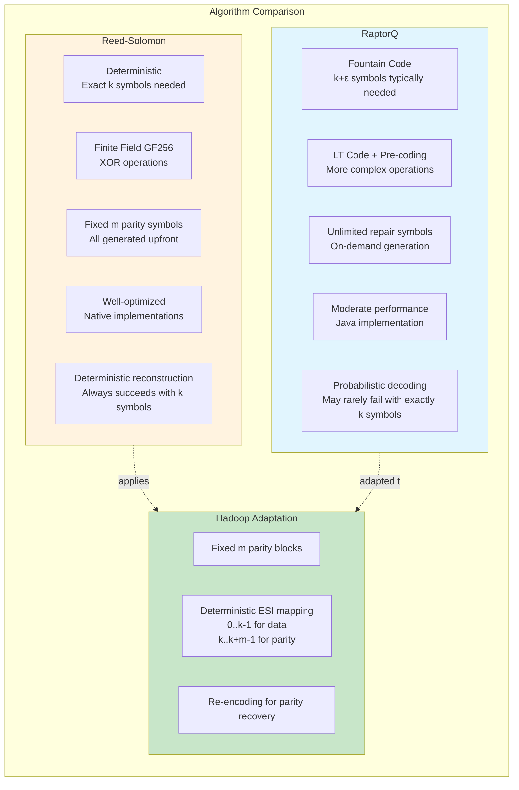

# Reed-Solomon vs RaptorQ Comparison

```mermaid
graph TB
    subgraph Comparison["Algorithm Comparison"]
        direction TB
        
        subgraph RS[Reed-Solomon]
            RS1[Deterministic<br/>Exact k symbols needed]
            RS2[Finite Field GF256<br/>XOR operations]
            RS3[Fixed m parity symbols<br/>All generated upfront]
            RS4[Well-optimized<br/>Native implementations]
            RS5[Deterministic reconstruction<br/>Always succeeds with k symbols]
        end
        
        subgraph RQ[RaptorQ]
            RQ1[Fountain Code<br/>k+ε symbols typically needed]
            RQ2[LT Code + Pre-coding<br/>More complex operations]
            RQ3[Unlimited repair symbols<br/>On-demand generation]
            RQ4[Moderate performance<br/>Java implementation]
            RQ5[Probabilistic decoding<br/>May rarely fail with exactly k symbols]
        end
        
        subgraph Hadoop[Hadoop Adaptation]
            H1[Fixed m parity blocks]
            H2[Deterministic ESI mapping<br/>0..k-1 for data<br/>k..k+m-1 for parity]
            H3[Re-encoding for parity recovery]
        end
    end
    
    RS -.applies.-> Hadoop
    RQ -.adapted to.-> Hadoop
    
    style RS fill:#FFF3E0
    style RQ fill:#E1F5FE
    style Hadoop fill:#C8E6C9
```

