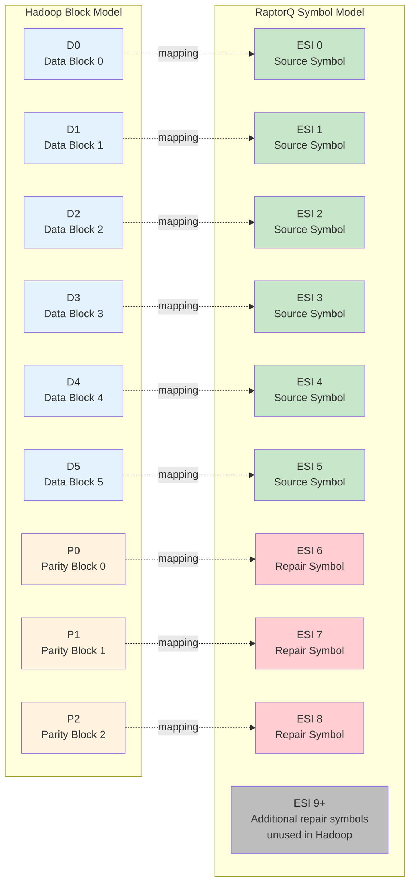

# ESI (Encoding Symbol Identifier) Mapping

```mermaid
graph LR
    subgraph "Hadoop Block Model"
        direction TB
        D0[D0<br/>Data Block 0]
        D1[D1<br/>Data Block 1]
        D2[D2<br/>Data Block 2]
        D3[D3<br/>Data Block 3]
        D4[D4<br/>Data Block 4]
        D5[D5<br/>Data Block 5]
        
        P0[P0<br/>Parity Block 0]
        P1[P1<br/>Parity Block 1]
        P2[P2<br/>Parity Block 2]
    end
    
    subgraph "RaptorQ Symbol Model"
        direction TB
        ESI0[ESI 0<br/>Source Symbol]
        ESI1[ESI 1<br/>Source Symbol]
        ESI2[ESI 2<br/>Source Symbol]
        ESI3[ESI 3<br/>Source Symbol]
        ESI4[ESI 4<br/>Source Symbol]
        ESI5[ESI 5<br/>Source Symbol]
        
        ESI6[ESI 6<br/>Repair Symbol]
        ESI7[ESI 7<br/>Repair Symbol]
        ESI8[ESI 8<br/>Repair Symbol]
        
        More[ESI 9+<br/>Additional repair symbols<br/>unused in Hadoop]
    end
    
    D0 -.mapping.-> ESI0
    D1 -.mapping.-> ESI1
    D2 -.mapping.-> ESI2
    D3 -.mapping.-> ESI3
    D4 -.mapping.-> ESI4
    D5 -.mapping.-> ESI5
    
    P0 -.mapping.-> ESI6
    P1 -.mapping.-> ESI7
    P2 -.mapping.-> ESI8
    
    style D0 fill:#E3F2FD
    style D1 fill:#E3F2FD
    style D2 fill:#E3F2FD
    style D3 fill:#E3F2FD
    style D4 fill:#E3F2FD
    style D5 fill:#E3F2FD
    
    style P0 fill:#FFF3E0
    style P1 fill:#FFF3E0
    style P2 fill:#FFF3E0
    
    style ESI0 fill:#C8E6C9
    style ESI1 fill:#C8E6C9
    style ESI2 fill:#C8E6C9
    style ESI3 fill:#C8E6C9
    style ESI4 fill:#C8E6C9
    style ESI5 fill:#C8E6C9
    
    style ESI6 fill:#FFCDD2
    style ESI7 fill:#FFCDD2
    style ESI8 fill:#FFCDD2
    
    style More fill:#BDBDBD
```

