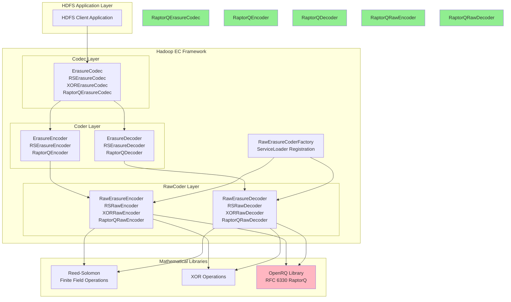

# Hadoop Erasure Coding Architecture

```mermaid
graph TB
    subgraph "HDFS Application Layer"
        App[HDFS Client Application]
    end
    
    subgraph "Hadoop EC Framework"
        subgraph "Codec Layer"
            Codec[ErasureCodec<br/>RSErasureCodec<br/>XORErasureCodec<br/>RaptorQErasureCodec]
        end
        
        subgraph "Coder Layer"
            Encoder[ErasureEncoder<br/>RSErasureEncoder<br/>RaptorQEncoder]
            Decoder[ErasureDecoder<br/>RSErasureDecoder<br/>RaptorQDecoder]
        end
        
        subgraph "RawCoder Layer"
            RawEnc[RawErasureEncoder<br/>RSRawEncoder<br/>XORRawEncoder<br/>RaptorQRawEncoder]
            RawDec[RawErasureDecoder<br/>RSRawDecoder<br/>XORRawDecoder<br/>RaptorQRawDecoder]
        end
        
        Factory[RawErasureCoderFactory<br/>ServiceLoader Registration]
    end
    
    subgraph "Mathematical Libraries"
        RSImpl[Reed-Solomon<br/>Finite Field Operations]
        XORImpl[XOR Operations]
        OpenRQ[OpenRQ Library<br/>RFC 6330 RaptorQ]
    end
    
    App --> Codec
    Codec --> Encoder
    Codec --> Decoder
    Encoder --> RawEnc
    Decoder --> RawDec
    RawEnc --> RSImpl
    RawEnc --> XORImpl
    RawEnc --> OpenRQ
    RawDec --> RSImpl
    RawDec --> XORImpl
    RawDec --> OpenRQ
    Factory --> RawEnc
    Factory --> RawDec
    
    style RaptorQErasureCodec fill:#90EE90
    style RaptorQEncoder fill:#90EE90
    style RaptorQDecoder fill:#90EE90
    style RaptorQRawEncoder fill:#90EE90
    style RaptorQRawDecoder fill:#90EE90
    style OpenRQ fill:#FFB6C1
```

