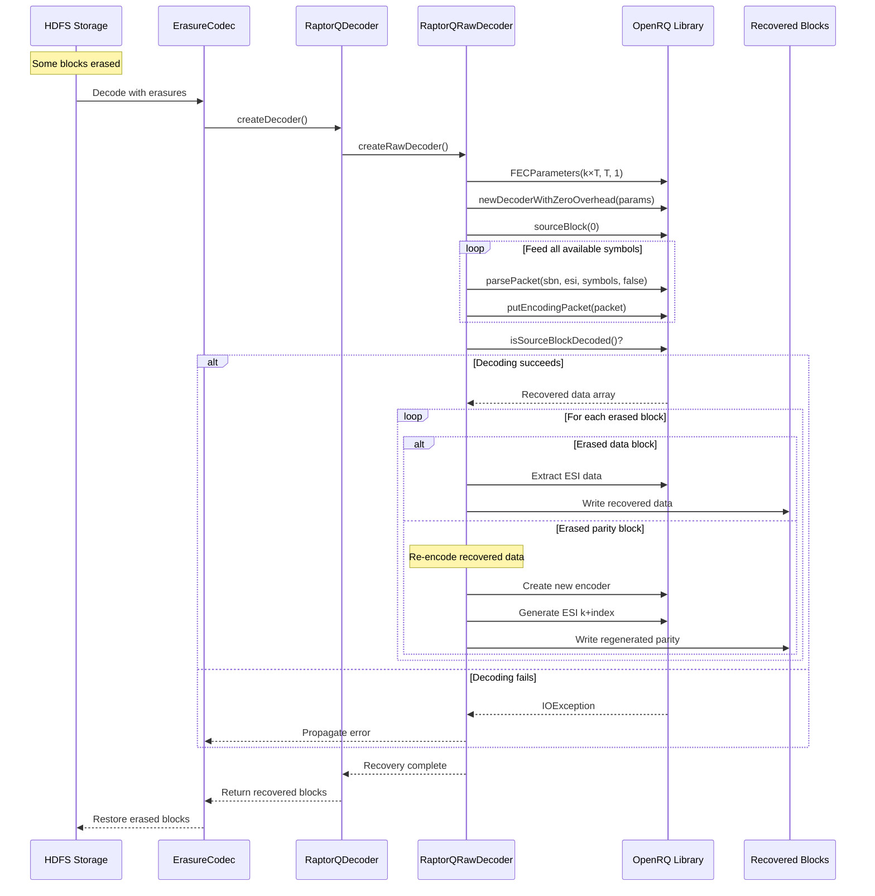

# RaptorQ Decoding Flow in Hadoop

```mermaid
sequenceDiagram
    participant HDFS as HDFS Storage
    participant EC as ErasureCodec
    participant Dec as RaptorQDecoder
    participant RawDec as RaptorQRawDecoder
    participant OpenRQ as OpenRQ Library
    participant Recov as Recovered Blocks
    
    Note over HDFS: Some blocks erased
    
    HDFS->>EC: Decode with erasures
    EC->>Dec: createDecoder()
    Dec->>RawDec: createRawDecoder()
    
    RawDec->>OpenRQ: FECParameters(k×T, T, 1)
    RawDec->>OpenRQ: newDecoderWithZeroOverhead(params)
    RawDec->>OpenRQ: sourceBlock(0)
    
    loop Feed all available symbols
        RawDec->>OpenRQ: parsePacket(sbn, esi, symbols, false)
        RawDec->>OpenRQ: putEncodingPacket(packet)
    end
    
    RawDec->>OpenRQ: isSourceBlockDecoded()?
    alt Decoding succeeds
        OpenRQ-->>RawDec: Recovered data array
        
        loop For each erased block
            alt Erased data block
                RawDec->>OpenRQ: Extract ESI data
                RawDec->>Recov: Write recovered data
            else Erased parity block
                Note over RawDec: Re-encode recovered data
                RawDec->>OpenRQ: Create new encoder
                RawDec->>OpenRQ: Generate ESI k+index
                RawDec->>Recov: Write regenerated parity
            end
        end
    else Decoding fails
        OpenRQ-->>RawDec: IOException
        RawDec-->>EC: Propagate error
    end
    
    RawDec-->>Dec: Recovery complete
    Dec-->>EC: Return recovered blocks
    EC-->>HDFS: Restore erased blocks
```

